# CLR_Windows_Forms-Press_F_To_Add_Numbers
使用  C++ CLR  撰寫 Windows Forms 視窗程式。視窗功能：每按下1次鍵盤F，可讓畫面的數字加1；另外按下暫停按鈕，則可讓畫面的數字不要加1。


## 開發環境
* IDE：Visual Studio 2022
* 程式語言：C++
* 使用框架：CLR (.Net Framework)
* .Net Framework 版本：v4.8
* 專案名稱：CLR_Windows_Forms-Press_F_To_Add_Numbers


## C++ CLR Windows Form 安裝教學

### 一、 環境安裝
1. 安裝【Visual Studio】 (https://visualstudio.microsoft.com) 。

2. 安裝過程中，在『工作負載』的『傳統型與行動裝置』中，把『使用 C++ 的桌面開發』的選項打勾。
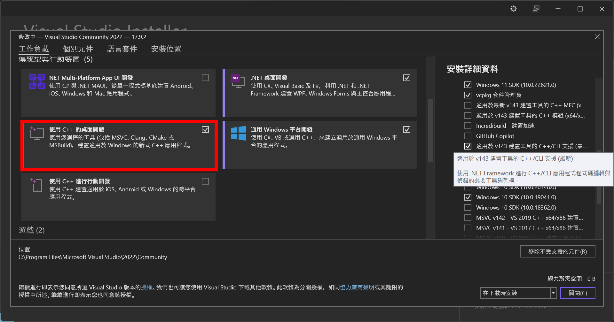

3. 接著，在右邊『安裝詳細資料』的『使用 C++ 的桌面開發』中，把『適用於 v143 建置工具的 C++/CLI 支援』的選項打勾。


### 二、 建立專案
1. 在電腦上開啟【Visual Studio 2022】。

2. 點擊『建立新的專案』。

3. 在搜尋欄上搜尋『CLR』。

4. 選擇『CLR 空白專案 (.NET Framework)』。


### 三、 設定專案
1. 對右邊的『方案總管』中所建立的『專案名稱』按滑鼠右鍵，點擊『屬性』。
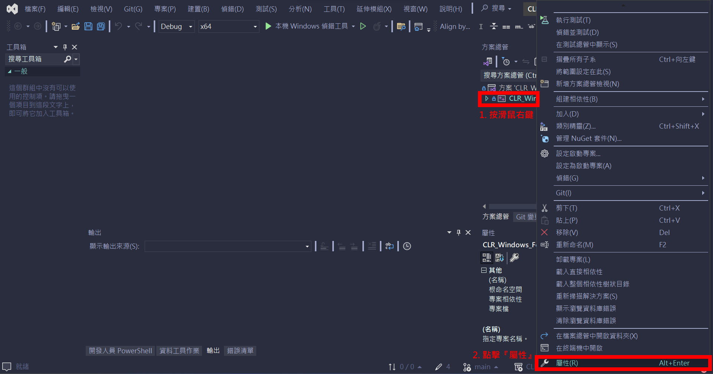

2. 將最上面的『組態』選擇『Debug』、『平台』選擇『X64』。
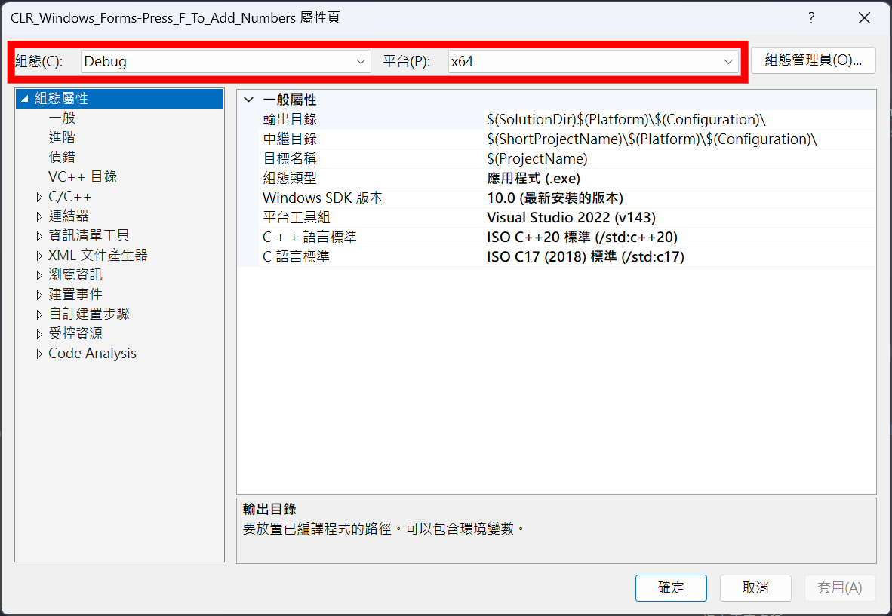

3. 點擊『連結器』的『系統』，在『子系統』中選擇『Windows(/SUBSYSTEM:WINDOWS)』。
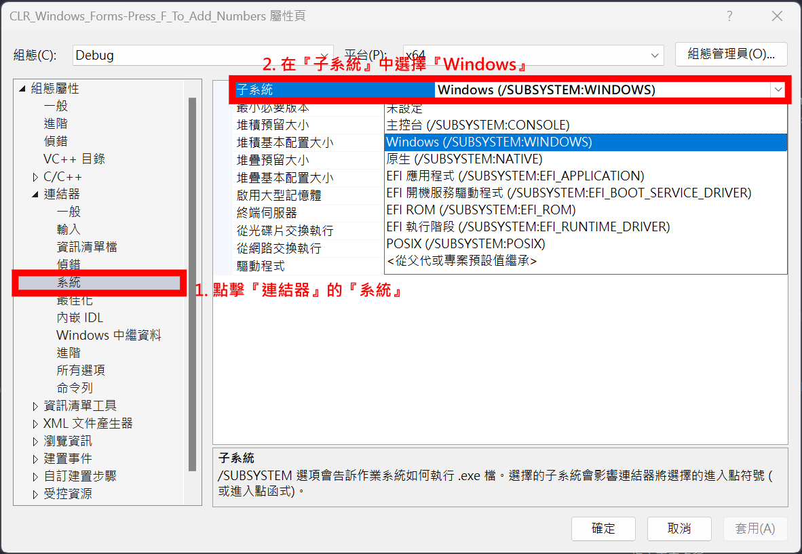

4. 點擊『連結器』的『進階』，在『進入點』中輸入『main』。
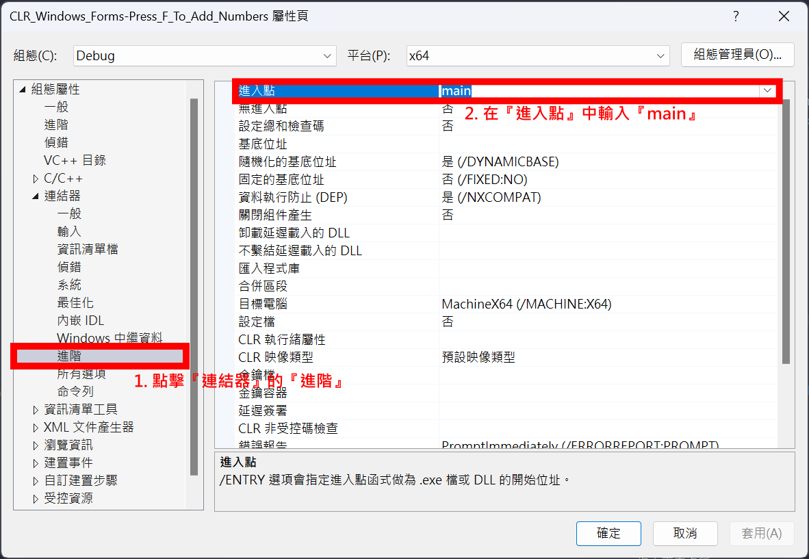

### 四、 新增視窗程式 (Windows Form)
1. 對右邊的『方案總管』中所建立的『專案名稱』按滑鼠右鍵，先點擊『加入』，再點擊『新增項目』。
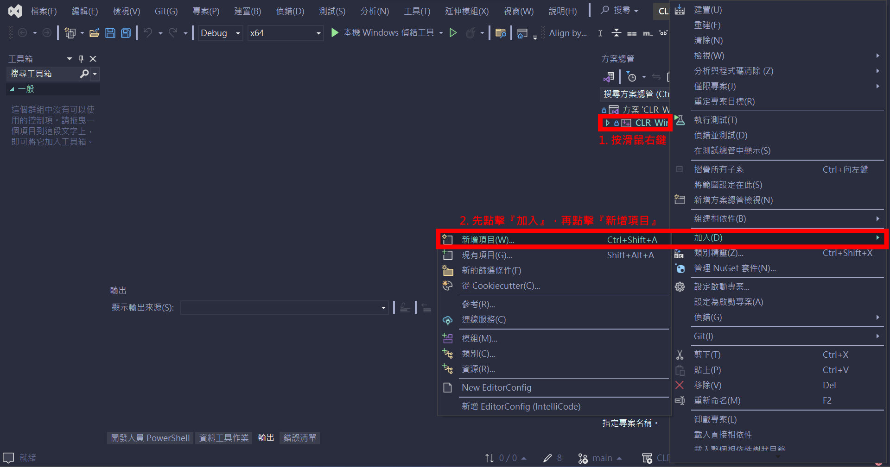

2. 點擊『Visual C++』的『UI』，選擇『Windows Form』，按新增。


3. 重啟開啟【Visual Studio 2022】 (因為在新增『Windows Form』之後，會出現錯誤訊息，必須重新開啟，才能解決錯誤訊息)。


### 五、 撰寫程式
#### 『MyForm.cpp』
1. 開啟 MyForm.cpp，程式碼如下：
```c++
#include "MyForm.h"

```

2. 將 MyForm.cpp，修改成如下的程式碼：
```c++
#include "MyForm.h"

using namespace System;
using namespace System::Windows::Forms;

[STAThreadAttribute]
void main(array<String^>^ args) {
	Application::EnableVisualStyles();
	Application::SetCompatibleTextRenderingDefault(false);
	CLRWindowsFormsPressFToAddNumbers::MyForm form;
	Application::Run(% form);
}
```
註：『CLRWindowsFormsPressFToAddNumbers』請更改成您的專案名稱。

#### 『MyForm.h』
1. 視窗介面設計
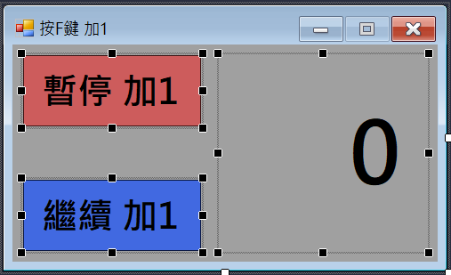
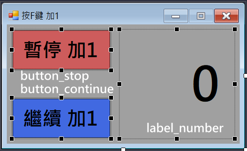

2. 在視窗『MyForm』的屬性中，將【KeyPreview】設定成『True』(這樣按鍵事件才會啟用)。
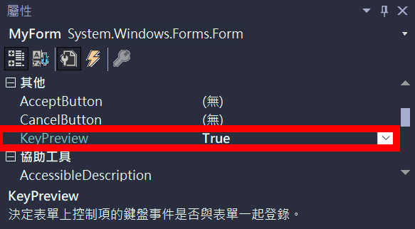

3. 對視窗『MyForm』新增『KeyDown』事件，並輸入下面程式碼：
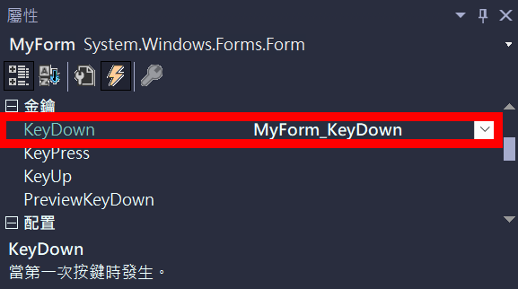

```c++
/* 鍵盤按鍵被按下的事件 */
private: System::Void MyForm_KeyDown(System::Object^ sender, System::Windows::Forms::KeyEventArgs^ e) 
{
	int number = Convert::ToInt32(label_number->Text);
	if (e->KeyCode == Keys::F)
	{
		number += 1;
		label_number->Text = number.ToString();
	}
}
```

4. 對按鈕『button_stop』新增『Click』事件，並輸入下面程式碼：
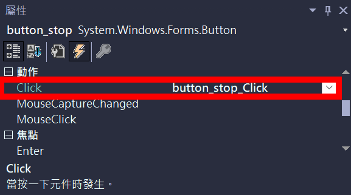

```c++
/* 按鈕【暫停 加1】被點擊的事件 */
private: System::Void button_stop_Click(System::Object^ sender, System::EventArgs^ e)
{
	MyForm::KeyPreview = false; // 不接收按鍵事件
}
```

5. 對按鈕『button_continue』新增『Click』事件，並輸入下面程式碼：
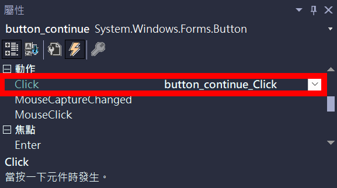

```c++
/* 按鈕【繼續 加1】被點擊的事件 */
private: System::Void button_continue_Click(System::Object^ sender, System::EventArgs^ e)
{
	MyForm::KeyPreview = true; // 接收按鍵事件
}
```

<hr>
